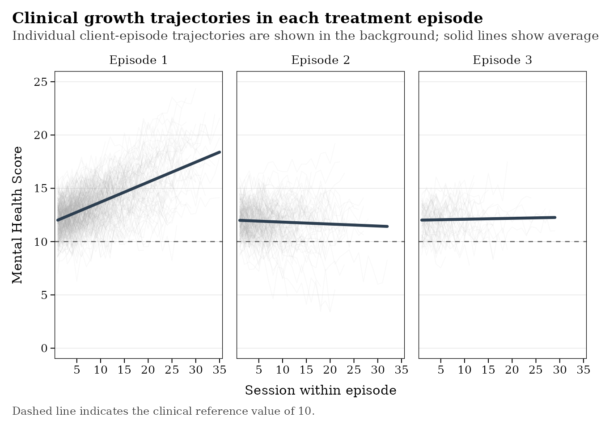

# Get Started with leap

## Overview

A typical `leap` workflow progresses from preparing the raw data to
identifying, describing, visualizing, and modeling repeated episodes of
treatment. The package is designed to accommodate real-world treatment
records in which clients may attend different numbers of sessions and
episodes of care, with some completing a single episode and others
returning for treatment multiple times over time.

## Step 1: Prepare and check

`leap` works with person-period longitudinal data, where each row
represents a treatment session for a client. At minimum, the raw data
should include variables identifying the `client`, `session`,
`session date`, and the `outcome` of interest measured at each session.

The example below illustrates how the data can look:

``` r

head(raw_df)
```

    ##   client_id session_id session_date  outcome
    ## 1  client_1          1   2018-01-11 12.30153
    ## 2  client_1          2   2018-02-05 12.12299
    ## 3  client_1          3   2018-02-18 13.76293
    ## 4  client_1          4   2018-03-01 11.10154
    ## 5  client_1          5   2018-03-16 12.53960
    ## 6  client_1          6   2018-04-15 11.56142

It is important to be aware that `leap` uses a standardized set of
variable names throughout its functions. If the original data use
different names,
[`cols_standard()`](https://frostnd.github.io/leap/reference/cols_standard.md)
can be used to rename the core variables before proceeding.

Once the variables have been standardized,
[`check_raw()`](https://frostnd.github.io/leap/reference/check_raw.md)
can be used to verify that the data contain the information required to
identify treatment episodes:

``` r

check_raw(raw_df)
```

    ##            variable            column     type present
    ## 1            client         client_id Required    TRUE
    ## 2              date      session_date Required    TRUE
    ## 3           outcome           outcome Required    TRUE
    ## 4       session_lag       session_lag  Derived   FALSE
    ## 5        episode_id        episode_id  Derived   FALSE
    ## 6   episode_session   episode_session  Derived   FALSE
    ## 7 client_episode_id client_episode_id  Derived   FALSE
    ## 8        n_episodes        n_episodes  Derived   FALSE
    ##                        action
    ## 1                       Ready
    ## 2                       Ready
    ## 3                       Ready
    ## 4       Run add_session_lag()
    ## 5        Run add_episode_id()
    ## 6   Run add_episode_session()
    ## 7 Run add_client_episode_id()
    ## 8     Run add_episode_count()

The output from this initial check identifies the variables already
present in the data, the episode-related variables that still need to be
created, and the corresponding `add_*()` function to create each of the
missing variables.

## Step 2: Identify episodes

Once the session-level data have been prepared, leap can identify
distinct treatment episodes and generate the episode-level variables
required for subsequent analyses. By default, `leap` demarcates episodes
based on periods of treatment inactivity, specifically the number of
days between consecutive sessions. See [Define
Episodes](https://frostnd.github.io/leap/articles/articles/define-episodes.md)
for additional details.

Episode indicators can be added individually or simultaneously using the
wrapper function
[`add_episode_vars()`](https://frostnd.github.io/leap/reference/add_episode_vars.md).
The new variables this function creates are

- `session_lag`: identifies the number of days elapsed since last
  session
- `episode_id`: identifies each distinct treatment episode for a client
- `episode_session`: identifies the consecutive session number in each
  episode
- `n_episodes`: indicates the total number of treatment episodes a
  client attended

``` r

# create all episode variables
episode_df <- add_episode_vars(raw_df) 
```

After all episode variables are added, the
[`check_eps()`](https://frostnd.github.io/leap/reference/check_eps.md)
function can be used to check the resulting data structure.

``` r

# check episode structure 
check_eps(episode_df)
```

    ## Warning: 57 episode(s) contain only one session.

    ## Warning: 191 episode(s) contain four or fewer sessions.

    ##    obs clients episodes na_total na_outcomes na_dates correctly_ordered
    ## 1 7599     400        3      400           0        0              TRUE
    ##   sequential_sessions chronological_dates
    ## 1                TRUE                TRUE

Importantly,
[`check_eps()`](https://frostnd.github.io/leap/reference/check_eps.md)
will also warn the user when episodes contain too few observations to
reliably estimate change.

## Step 3: Describe episodes

Once episode indicators have been added, each unique episode can be
summarized using
[`describe_episodes()`](https://frostnd.github.io/leap/reference/describe_episodes.md)
function shown below

``` r

describe_episodes(episode_df)
```

    ##   episode_id n_clients n_sessions mean_sessions mean_duration_days
    ## 1          1       400       4663         11.66             197.34
    ## 2          2       238       2237          9.40             154.24
    ## 3          3        96        699          7.28             116.45
    ##   mean_lag_days mean_outcome
    ## 1         18.52        13.59
    ## 2         30.78        11.87
    ## 3         34.78        12.07

This summary provides an initial description of service utilization and
the characteristics of each treatment episode contained in the data.

## Step 4: Visualize episodes

Before fitting statistical models, it is often useful to visually
inspect patterns of change within and across treatment episodes. The
`plot_*()` family of functions provides several ways to explore these
patterns. For example,
[`plot_episode_curves()`](https://frostnd.github.io/leap/reference/plot_episode_curves.md)
displays individual client trajectories alongside the average linear
pattern within each episode.

``` r

plot_episode_curves(episode_df)
```



Visualizing treatment trajectories can reveal differences in starting
levels, treatment duration, rates of change, and variability across
successive episodes. Because the clients contributing to each episode
number may differ, these plots are primarily descriptive and should not
be interpreted as adjusted within-client effects. For additional
plotting options see [Visualize
Episodes](https://frostnd.github.io/leap/articles/articles/viz-episodes.md)

## Step 5: Model outcomes

`leap` provides several complementary approaches for modeling
therapeutic change across repeated episodes of care. These methods
differ in whether change is modeled directly from session-level
observations or summarized at the episode level.

For example, a longitudinal mixed-effects model can be fit directly to
session-level data:

``` r

mod <- fit_lme(episode_data, cohort = "all", model = "episode")
```

This approach estimates change within treatment episodes while
accounting for the hierarchical structure of sessions nested within
episodes and clients.

Alternative functions support slopes-as-outcomes and Bayesian multilevel
approaches for examining change within and across episodes. For a
detailed discussion of the available models and their interpretation,
see [Model
Episodes](https://frostnd.github.io/leap/articles/articles/modeling-episodes.md)

## Summary

This article introduced a typical leap workflow. The package functions
offer considerably more flexibility than can be demonstrated here. For
additional options and guidance, consult the function documentation and
the subsequent articles.
