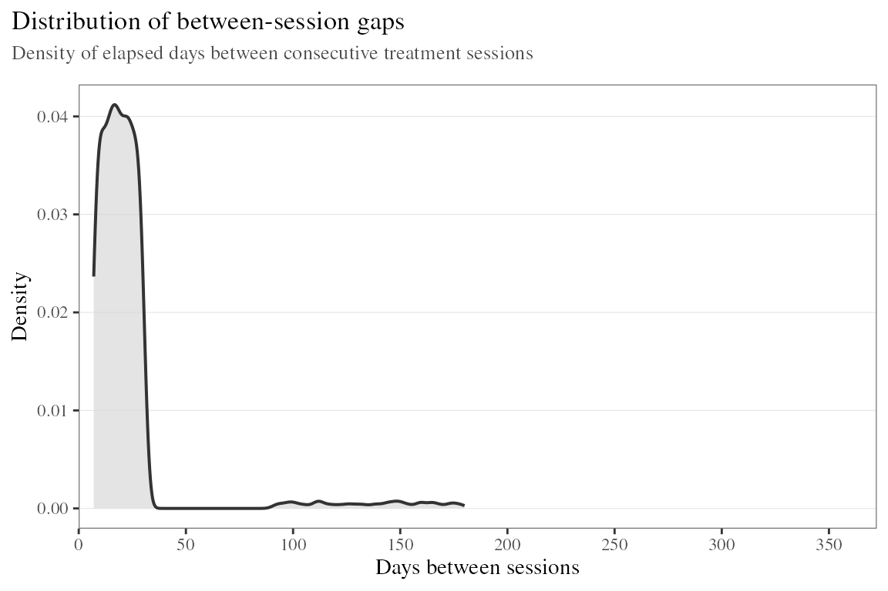
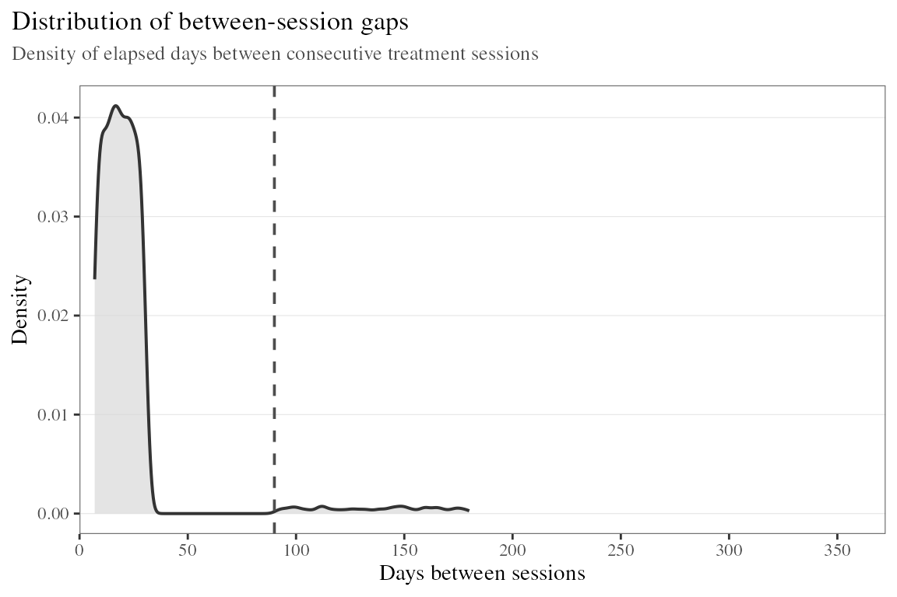
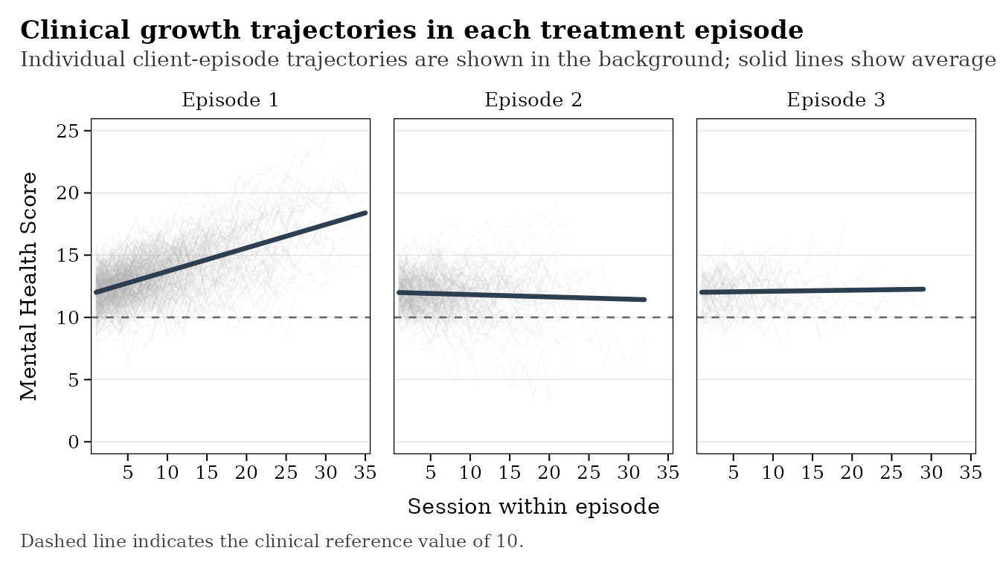
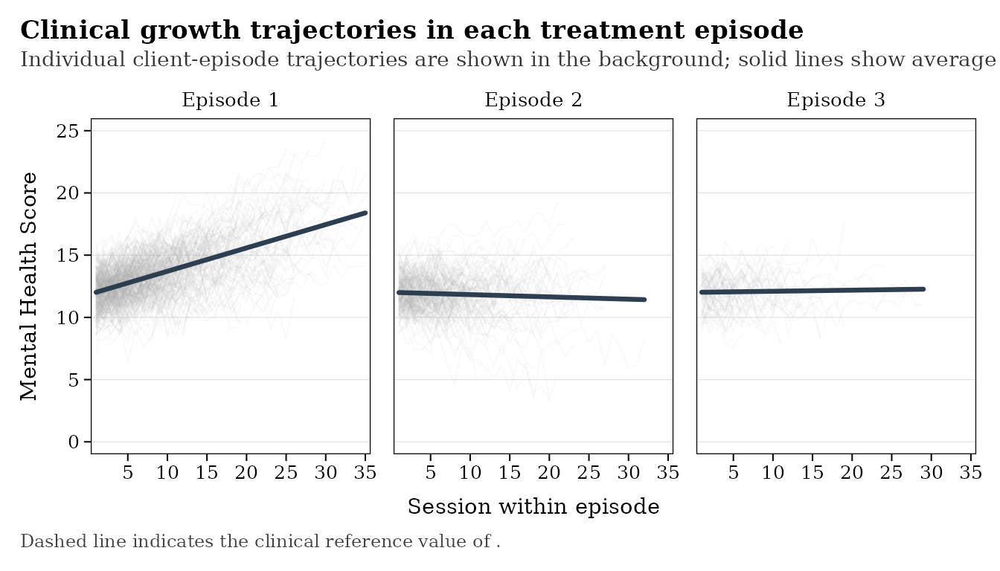
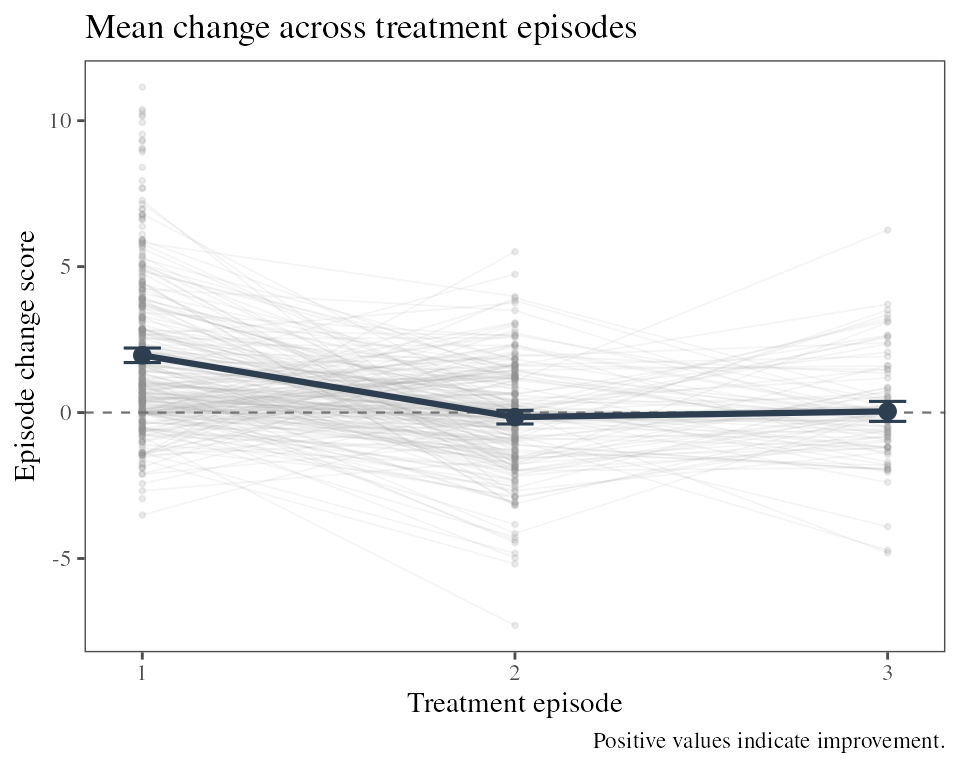
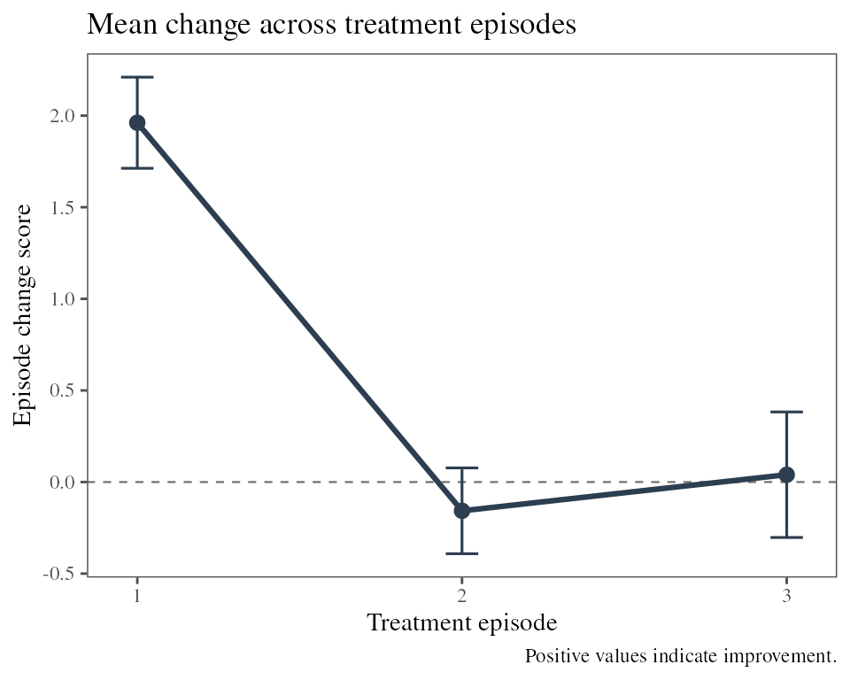
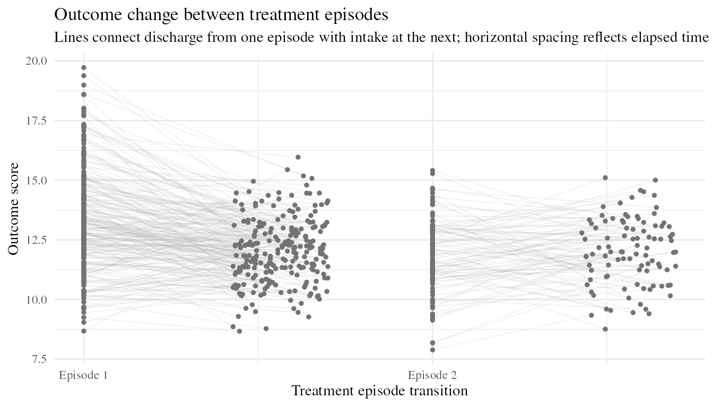
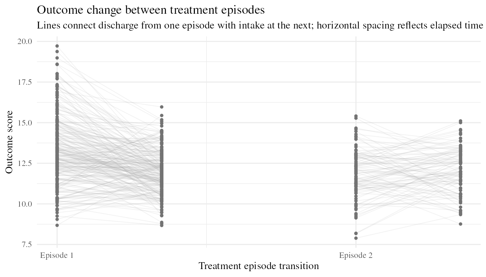

# Visualize Episodes

## Overview

Visualizing episodes can help researchers understand when episodes
occur, how outcomes change within episodes, and what happens during
periods between episodes.

`leap` provides plotting functions for several complementary features of
multi-episode data:

- [`plot_lag_density()`](https://frostnd.github.io/leap/reference/plot_lag_density.md)
  visualizes the distribution of time between consecutive sessions.
- [`plot_episode_curves()`](https://frostnd.github.io/leap/reference/plot_episode_curves.md)
  displays session-level outcome trajectories within successive
  treatment episodes.
- [`plot_episode_change()`](https://frostnd.github.io/leap/reference/plot_episode_change.md)
  summarizes treatment change across episode number.
- `plot_breaks_loss()` visualizes outcome loss between consecutive
  treatment episodes.

These functions operate at different levels of the treatment record.
Some use session-level observations directly, whereas others use
episode- or transition-level summaries produced by other `leap`
functions.

## Plot session lags

Treatment episodes are commonly distinguished by the amount of elapsed
time between consecutive sessions. Before selecting an episode
delimiter, it can be useful to inspect the empirical distribution of
session lags.

``` r

plot_lag_density(episode_data)
```



[`plot_lag_density()`](https://frostnd.github.io/leap/reference/plot_lag_density.md)
displays the density of positive `session_lag` values. The first session
observed for each client has an undefined lag and is excluded from the
distribution.

A candidate delimiter can also be displayed directly:

``` r

plot_lag_density(episode_data, delimiter = 90)
```



## Plot episode growth curves

Once episodes have been identified,
[`plot_episode_curves()`](https://frostnd.github.io/leap/reference/plot_episode_curves.md)
provides a direct view of session-level change within successive
episodes.

``` r

plot_episode_curves(episode_data)
```



Each panel represents a treatment episode number. Individual
client-episode trajectories are displayed in the background, while a
pooled linear trend is superimposed within each episode.

For example, the Episode 2 panel contains observations from clients who
contributed a second treatment episode. Because fewer clients typically
contribute observations to later episodes, the composition of the sample
may differ across panels.

The plot is therefore primarily descriptive. Differences between
episode-specific trends should not automatically be interpreted as
adjusted within-client effects.

``` r

plot_episode_curves(episode_data, clinical_cutoff = NULL)
```



[`plot_episode_curves()`](https://frostnd.github.io/leap/reference/plot_episode_curves.md)
is particularly useful during exploratory analysis because it makes
several features of the data visible simultaneously, including
variability in baseline scores, rates of change, episode length, and the
number of clients contributing to successive episodes.

## Plot episode change scores

Session-level trajectories can also be reduced to episode-level
summaries using
[`episode_slopes()`](https://frostnd.github.io/leap/reference/episode_slopes.md).

``` r

episode_summary <- episode_slopes(episode_data, higher_is_better = TRUE)
```

The returned data contain one row per client-specific treatment episode
and include variables such as:

- `pre`
- `post`
- `change`
- `slope`
- `n_sessions`

These episode-level summaries can be passed directly to
[`plot_episode_change()`](https://frostnd.github.io/leap/reference/plot_episode_change.md):

``` r

plot_episode_change(episode_summary)
```



The plot displays individual client change scores across successive
treatment episodes and superimposes the mean change for each episode
number with approximate 95% confidence intervals.

Positive values represent improvement when the episode summaries were
created so that higher values consistently indicate favorable change.

For larger samples, individual trajectories can be hidden to emphasize
the episode-level summaries:

``` r

plot_episode_change(episode_summary, show_individuals = FALSE)
```



An important distinction is that
[`plot_episode_curves()`](https://frostnd.github.io/leap/reference/plot_episode_curves.md)
and
[`plot_episode_change()`](https://frostnd.github.io/leap/reference/plot_episode_change.md)
operate at different levels of the data:

``` text
session-level data
  |- plot_episode_curves()
  |- episode_slopes()
    |- plot_episode_change()
```

[`plot_episode_curves()`](https://frostnd.github.io/leap/reference/plot_episode_curves.md)
displays the observed treatment trajectories within episodes, whereas
[`plot_episode_change()`](https://frostnd.github.io/leap/reference/plot_episode_change.md)
summarizes how the amount of treatment change varies across episode
number.

## Plot episode decline

Treatment change can also occur outside active treatment. Clients may
leave treatment at one level of functioning and return later with some
degree of deterioration.

[`episode_breaks()`](https://frostnd.github.io/leap/reference/episode_breaks.md)
summarizes these transitions between successive episodes:

``` r

breaks <- episode_breaks(episode_data)
```

Each row of the resulting data represents the transition from one
treatment episode to the next for a client and includes variables such
as:

- `prior_episode`
- `next_episode`
- `prior_discharge`
- `next_intake`
- `days_between`
- `bad_enough_level`
- `loss_per_month`

These data can be visualized using `plot_breaks_loss()`:

``` r

plot_episode_loss(breaks)
```


The plot connects the discharge score from one episode with the intake
score at the subsequent episode. This provides a visual representation
of the amount of outcome loss occurring between episodes.

When time is displayed, horizontal spacing can reflect the relative
amount of time between episodes:

``` r

plot_episode_loss(breaks, show_time = TRUE)
```



Equal spacing can instead be used when the primary interest is the
magnitude of change:

``` r

plot_episode_loss(breaks, show_time = FALSE)
```



Because only clients with multiple episodes can contribute
between-episode transitions, a separate multiple-episode cohort
restriction is not required.

## Summary

The visualization functions in `leap` provide complementary views of
repeated treatment episodes:

- Use
  [`plot_lag_density()`](https://frostnd.github.io/leap/reference/plot_lag_density.md)
  to inspect the temporal spacing of sessions and candidate episode
  delimiters.
- Use
  [`plot_episode_curves()`](https://frostnd.github.io/leap/reference/plot_episode_curves.md)
  to examine observed session-level trajectories within treatment
  episodes.
- Use
  [`plot_episode_change()`](https://frostnd.github.io/leap/reference/plot_episode_change.md)
  to compare episode-level treatment change across successive episodes.
- Use `plot_breaks_loss()` to examine outcome loss occurring between
  episodes.

Together, these plots can help researchers assess the structure of
multi-episode treatment data, identify potentially important patterns,
and guide subsequent statistical modeling.
