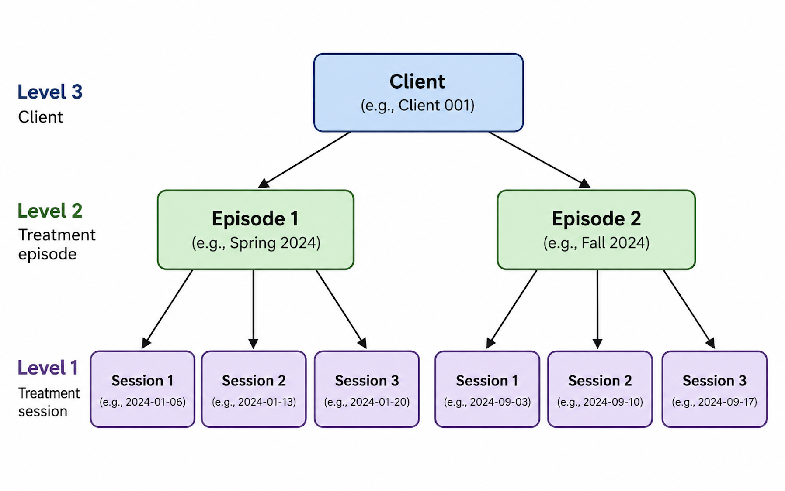

# Overview

`leap` is designed to work with data collected from the same individuals at multiple points in time. In psychotherapy and other behavioral health interventions, these data often consist of information collected at each treatment session, such as the session date and a measure of symptoms or well-being.

When individuals return to treatment over time, their sessions may belong to more than one distinct episode of care. This creates a natural hierarchical structure in the data: **sessions occur within treatment episodes, and treatment episodes occur within clients**. Recognizing this structure is an important first step in preparing data for analysis with `leap`.

This article introduces how longitudinal treatment data are organized in `leap`, including the structure of session-level records, how sessions and episodes are nested within clients, and the standard variables used throughout the package.

# Session-level data

The starting point for most leap workflows is a person-period data set in which each row represents a treatment session for a client. A typical data set might contain the following variables:

| Variable       | Description                       |
|:---------------|:----------------------------------|
| `client_id`    | Unique client identifier          |
| `session_id`   | Session identifier or sequence    |
| `session_date` | Date of the session               |
| `outcome`      | Session-level outcome measurement |

For example, longitudinal treatment records may have the following person-period format:

```{r data, include = FALSE}

# package 
library(tidyverse)

# load example data
load("~/Library/CloudStorage/Dropbox/01_desk/04_personal/02_data_science/02_projects/01_pkgs/leap/data/simulation_data.RData")


# select subset for vignette 
raw_data <- data %>%
  pluck("unbalanced", "clinical", "diminishing_resp") %>%
  nest_by(client_id) %>%
  ungroup() %>%
  slice_head(n = 3) %>%
  unnest(cols = data) %>% 
  group_by(client_id) %>% 
  slice_head(n = 3) %>% 
  ungroup()
```

```{r}
print(raw_data)
```

Importantly, treatment sessions do not need to be equally spaced, and clients do not need to contribute the same number of observations. These features are common in naturalistic treatment records and are accommodated by the episode-based structure used in `leap`.

# Hierarchical structure

A central feature of repeated treatment data is its hierarchical structure. Sessions are nested within treatment episodes, and treatment episodes are nested within clients:

{width="849"}

This distinction is important because observations from the same episode are not independent, and multiple episodes contributed by the same client are also related. The hierarchical structure therefore informs both how treatment episodes are represented in the data and how repeated observations are incorporated into statistical models.

# Overview of package data

`leap` includes simulated longitudinal psychotherapy data that illustrate common features of real-world treatment records, including unequal numbers of sessions, repeated episodes of care, and variation in treatment trajectories.

## Design: Balanced vs. Unbalanced

## Type: Stochastic vs. Clinical 

The data sets simulated are internal to leap and can be called by the user as seen below.

# Nesting

The core premise of leap, is that nesting occurs within longitudinal data, where sessions are nested within episodes and episodes nested within clients. Below is a visual illustration
