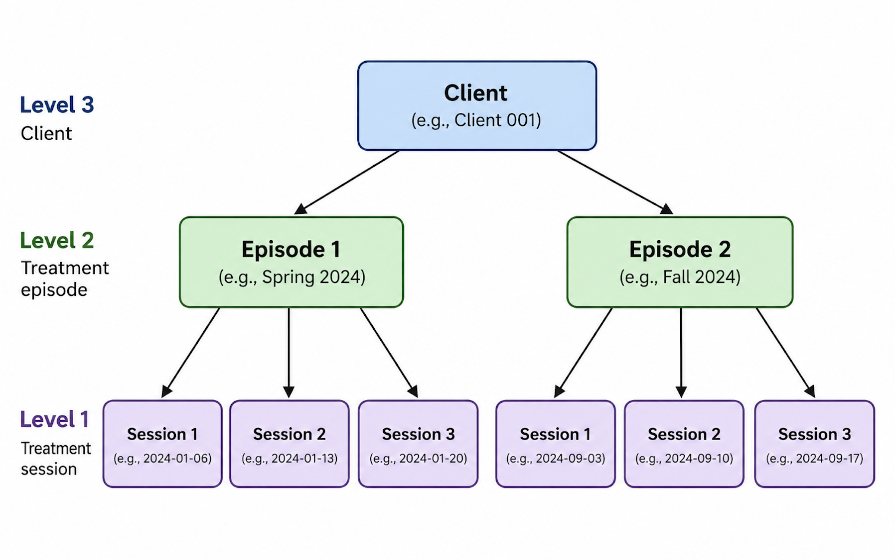

# Overview

This article describes the hierarchical structure of treatment episode data and introduces the datasets included with the `leap` package.

# Longitudinal data

Longitudinal psychotherapy data are hierarchical, or *nested*, because each client contributes multiple observations over time. Observations from the same individual are often correlated, so statistical analyses must account for this dependence.

The central premise of `leap` and is that longitudinal treatment data may contain an additional level of nesting when clients participate in multiple episodes of treatment. This structure is especially relevant in datasets that track service use over extended periods, such as electronic health records and other archival data. In these data, sessions are nested within treatment episodes, which are nested within clients:

- **Session**: An individual treatment visit or observation.
- **Episode**: A distinct period of treatment comprising one or more sessions.
- **Client**: An individual who may contribute one or more treatment episodes.

{width="490"}

# Simulated datasets

`leap` includes simulated longitudinal psychotherapy datasets that reflect common features of real-world treatment records and the hierarchical structure illustrated in Figure 1. These datasets vary along two key dimensions: **design** and **scenario type**.

## Design: balanced and unbalanced

The simulated data include both balanced and unbalanced longitudinal designs.

In the **balanced design**, clients contribute the same number of treatment episodes and the same number of sessions within each episode. This provides a simplified data structure that is useful for comparing and evaluating the performance of different statistical modeling approaches.

In the **unbalanced design**, clients may contribute different numbers of sessions and episodes of care. This structure more closely resembles naturalistic treatment records, where treatment duration and patterns of reengagement vary across clients.

## Scenario type: stochastic and clinical

Within each design, `leap` provides simulations representing different sources and patterns of variation.

**Stochastic scenarios** vary the amount of between-client and between-episode variability in treatment trajectories. These scenarios are useful for examining how different variance structures affect episode-based analyses.

**Clinical scenarios** represent systematic patterns of treatment and reengagement across episodes, such as recurrence, efficient return to treatment, persistent difficulty, and diminishing response.

Together, these simulated data provide controlled examples for demonstrating how `leap` functions behave across different longitudinal data structures and patterns of change.

## Clinical scenarios

#### Clinical scenario: diminishing therapeutic response

#### Clinical scenario: deteriorating therapeutic response

#### Clinical scenario: relapse and response

#### Clinical scenario: efficient return and response

# Summary

Readers interested in learning more about longitudinal data analysis of psychotherapy can find guides in the [Research Foundations](articles/rx-foundations.html) article.
